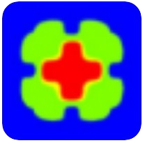
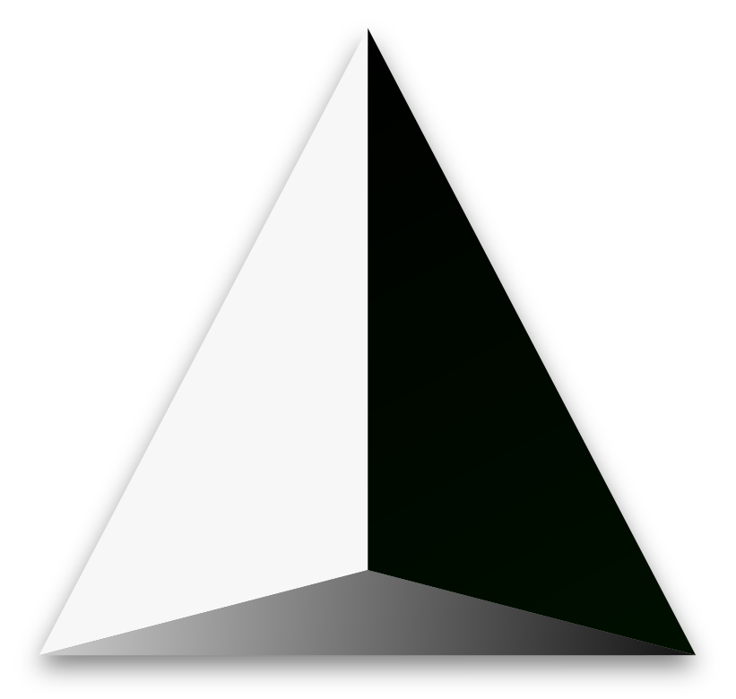

## Hi! You're looking at Pierre Laurentin's Github profile !

<h3 align="center"> I like numerical simulations 💻, coffee ☕ and volleyball 🏐  </h3>

<h4 align="center"> I went to CentraleSupélec in France 🇫🇷 to study engineering and finished my studies in Polytechnique Montréal 🇨🇦 to specialize in numerical simulations </h4>

<h4 align="center"> I am currently looking for a job as simulation (CFD) engineer in Aeronautics, Aerospatial or Chemistry where I can make the best use of my knowledge and technical skills ! </h4>

---

<h3 align="left">Languages and Tools:</h3>

- Programming Languages:
    

        
        
        
        
    

- Librairies:
    

       
       
        
    

- Scientific Tools
    

        
        
        
        
        
        
    

---
<h3> Projects I have worked on : </h3>

- From January 2023 to August 2024, I did my master's in the CHAOS (Chem. eng. High-performance Analysis Optimization and Simulation) group, I have worked on [Lethe](https://github.com/chaos-polymtl/lethe), an open-source CFD software using the finite elements method. This lead to the implementation of a solver for the Cahn-Hilliard equations which, coupled to the Navier-Stokes solver, allows to simulate multiphase flows.

<!--

- 🔭 I’m currently working on ...
- 🌱 I’m currently learning ...
- 👯 I’m looking to collaborate on ...
- 🤔 I’m looking for help with ...
- 💬 Ask me about ...
- 📫 How to reach me: ...
- 😄 Pronouns: ...
- ⚡ Fun fact: ...
-->
